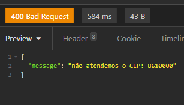

🚀 Tecnologias

Express
NodeJs
TypeScript

▶️ Como Instalar e Rodar Projeto

Clone this repository
$ git clone https://github.com/eduardoPolanski/calculoFrete_Node.git

$ cd calculoFrete_Node

#Instalando Dependências

	$ npm install
	$ npm run dev 

#Rota 

* Para consultar o valor e prazo de entrega usar a rota localhost:3559/consultafrete
* Em formato JSON informar cep e peso do produto como na imagem abaixo

* Se Cep estiver dentro das faixas de entrega o retorno sera o valor do frete e o prazo de entrega

* Se o C""

# Documentação está na rota localhost:3559/api-docs

# Servidor rodando na porta 3559